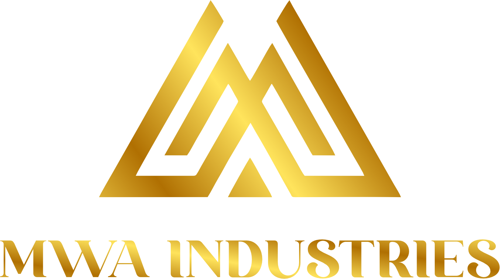

# MWA Industries Website

A premium, modern company website for MWA Industries - a metal fabrication and heavy engineering company.



## Features

- Premium dark/light theme with toggle
- Responsive design for all devices
- Contact and RFQ (Request for Quote) forms
- Admin panel for managing submissions
- Animated UI with Framer Motion
- SEO-friendly structure

## Tech Stack

### Frontend
- React 19
- TailwindCSS
- Framer Motion
- React Router DOM
- Shadcn/UI Components

### Backend
- FastAPI (Python)
- MongoDB
- Motor (async MongoDB driver)

## Project Structure

```
mwa-industries/
├── frontend/                 # React frontend
│   ├── public/
│   │   ├── images/          # Static images including logo
│   │   └── _redirects       # For SPA routing on Netlify
│   ├── src/
│   │   ├── components/      # Reusable components
│   │   ├── context/         # React contexts (Theme)
│   │   ├── data/            # Static data files
│   │   ├── pages/           # Page components
│   │   └── hooks/           # Custom hooks
│   ├── vercel.json          # Vercel configuration
│   └── package.json
│
├── backend/                  # FastAPI backend
│   ├── server.py            # Main API server
│   └── requirements.txt     # Python dependencies
│
└── README.md
```

## Deployment Options

### Option 1: Vercel (Frontend) + Railway/Render (Backend)

#### Frontend on Vercel

1. Push code to GitHub
2. Connect repository to Vercel
3. Configure build settings:
   - Build Command: `yarn build`
   - Output Directory: `build`
   - Root Directory: `frontend`
4. Add environment variables:
   - `REACT_APP_BACKEND_URL`: Your backend URL

#### Backend on Railway

1. Create new project on Railway
2. Connect GitHub repository
3. Set root directory to `backend`
4. Add environment variables:
   - `MONGO_URL`: Your MongoDB connection string
   - `DB_NAME`: `mwa_industries`
   - `CORS_ORIGINS`: Your frontend URL

### Option 2: Full Stack on Railway

1. Create two services from the same repo:
   - Frontend service (root: `frontend`)
   - Backend service (root: `backend`)
2. Configure environment variables for each

### Option 3: Netlify (Frontend Only)

1. Connect repository to Netlify
2. Configure build settings:
   - Build Command: `cd frontend && yarn build`
   - Publish Directory: `frontend/build`
3. Add environment variables

## Local Development

### Prerequisites
- Node.js 18+
- Python 3.10+
- MongoDB (local or Atlas)

### Frontend Setup

```bash
cd frontend
cp .env.example .env
# Edit .env with your backend URL
yarn install
yarn start
```

### Backend Setup

```bash
cd backend
cp .env.example .env
# Edit .env with your MongoDB URL
pip install -r requirements.txt
uvicorn server:app --reload --port 8001
```

## Environment Variables

### Frontend (.env)
```
REACT_APP_BACKEND_URL=http://localhost:8001
```

### Backend (.env)
```
MONGO_URL=mongodb://localhost:27017
DB_NAME=mwa_industries
CORS_ORIGINS=http://localhost:3000
```

## API Endpoints

| Method | Endpoint | Description |
|--------|----------|-------------|
| GET | `/api/` | Health check |
| POST | `/api/contact` | Submit contact form |
| POST | `/api/rfq` | Submit RFQ form |
| GET | `/api/admin/contacts` | Get all contacts |
| GET | `/api/admin/rfqs` | Get all RFQs |
| PATCH | `/api/admin/contacts/{id}/status` | Update contact status |
| PATCH | `/api/admin/rfqs/{id}/status` | Update RFQ status |

## Pages

- **Home** - Landing page with hero, services overview, projects
- **About** - Company story and values
- **Services** - 12 fabrication services with details
- **Industries** - Industries served
- **Projects** - Portfolio of completed projects
- **Quality** - Quality and safety policies
- **Contact** - Contact form and information
- **Request Quote** - RFQ form with file upload
- **Blog** - Company blog
- **Admin** - Manage form submissions

## Company Information

- **Name**: MWA Industries
- **Location**: Plot No. 78, Industrial Area, Bartori (Tilda), District Raipur (C.G.), India
- **Tagline**: "Excellence is our foundation. Trust is our legacy."

## License

Private - All rights reserved by MWA Industries

## Support

For questions or support, contact: mwaindustries@gmail.com
